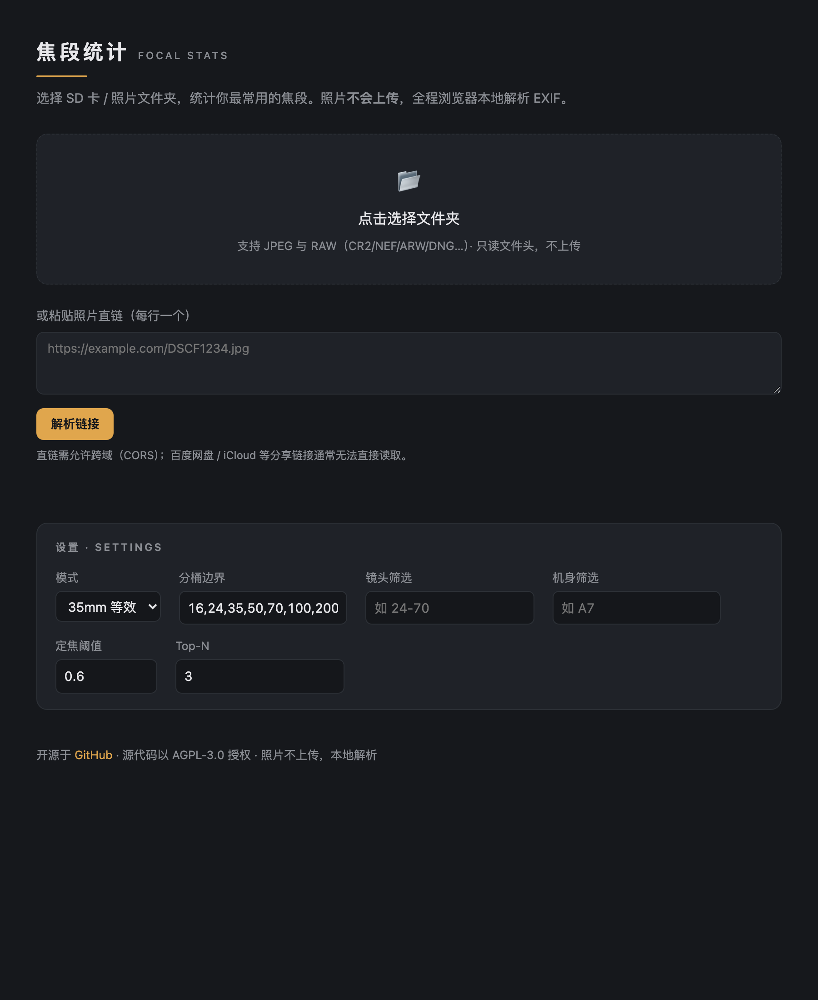
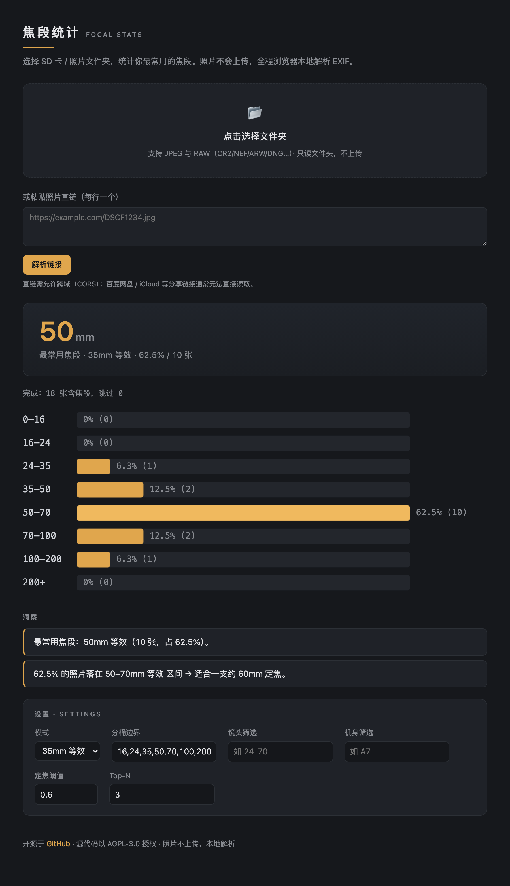

# Focal-Stats · 焦段统计

**English** · [简体中文](./README.zh-CN.md)

Read the EXIF from photos (including RAW) on an SD card or in a folder, find your
most-used focal lengths, and get lens suggestions.
Your photos are never uploaded — the CLI runs locally, and the web version parses
everything inside your browser.

## Screenshots

| Pick a folder | Focal-length results |
|---|---|
|  |  |

> Dark "Lightroom" style · a hero number for your most-used focal length · amber
> histogram (top bucket highlighted) · screenshots and other photos without
> focal-length data are skipped automatically.

## Web
Hosted on GitHub Pages: pick your SD-card folder → instantly see a focal-length
histogram and insights. Photos never leave your browser.

## CLI
```bash
npm install
npm run build:cli
node packages/cli/dist/index.js /Volumes/your-sd-card \
  --mode equiv35 --buckets 24,35,50,85 --lens "24-70" --top 5
# export: --json | --csv | --html
```

## Customization
- Bucket boundaries (`--buckets`)
- Lens / body filtering (`--lens` / `--camera`)
- Raw focal length ↔ 35mm equivalent (`--mode raw|equiv35`)
- Prime-suggestion threshold / Top-N (`--prime-threshold` / `--top`)

The CLI uses flags; the web version uses a settings panel (saved to localStorage).

## Performance
Reads only the first ~1 MB of each file (where EXIF lives), never the whole RAW.
The CLI reads files concurrently; the web version parses in a Web Worker.

## Development
```bash
npm test          # all unit tests
npm run build:web # build the web app
npm run build:cli # build the CLI
```

## Test fixtures
`packages/core/test/fixtures/sample.jpg` is generated by `make-fixture.mjs` (needs the
dev deps sharp + piexifjs). It's committed, so CI doesn't regenerate it.

## License
This project is licensed under [AGPL-3.0](./LICENSE). You may freely use, modify, and
distribute it, but **any derivative — including a modified version run as a network
service — must also be open-sourced under AGPL-3.0**, to prevent anyone from closing the
source or repackaging it into a proprietary product. Please keep the copyright and
license notices.

**Project name & trademark:** the code license does **not** cover the project name
**"焦段统计 / Focal-Stats" or its icon**. You're welcome to fork and modify it, but if you
redistribute a modified version, please use your own name so users don't mistake it for
the official project.

© 2026 SueMarsR
