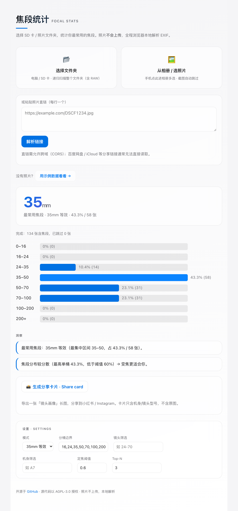
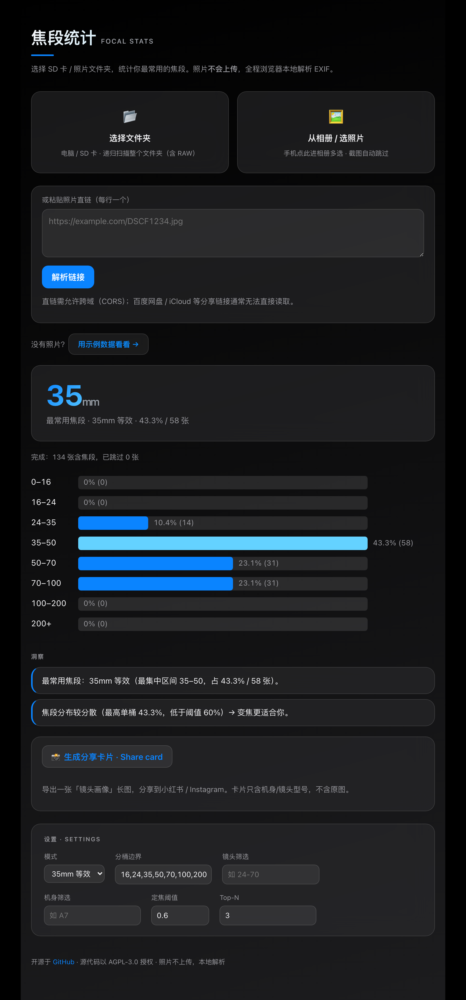

# Focal-Stats · 焦段统计

[English](./README.md) · **简体中文**

读取 SD 卡/文件夹里照片（含 RAW）的 EXIF，统计最常用焦段并给出镜头建议。
照片不上传：CLI 在本地、网页版在浏览器内全程本地解析。

## 截图

| 浅色 | 深色 |
|---|---|
|  |  |

> Apple 风格：跟随系统浅/深自动切换 · 毛玻璃面板 · 系统蓝渐变大数字 · 最常用焦段高亮。

## 网页版
部署在 GitHub Pages：选 SD 卡文件夹 → 即时看到焦段直方图与洞察。照片不离开浏览器。

## CLI
```bash
npm install
npm run build:cli
node packages/cli/dist/index.js /Volumes/你的SD卡 \
  --mode equiv35 --buckets 24,35,50,85 --lens "24-70" --top 5
# 导出：--json | --csv | --html
```

## 自定义
- 分桶边界（--buckets）
- 镜头/机身筛选（--lens / --camera）
- 原始焦距 ↔ 35mm 等效（--mode raw|equiv35）
- 定焦建议阈值 / Top-N（--prime-threshold / --top）

CLI 用参数，网页版用设置面板（存 localStorage）。

## 性能
只读每个文件头部约 1MB 的 EXIF，不读整张 RAW；CLI 并发读取，网页用 Web Worker 解析。

## 开发
```bash
npm test          # 全部单测
npm run build:web # 构建网页
npm run build:cli # 构建 CLI
```

## 测试夹具
`packages/core/test/fixtures/sample.jpg` 由 `make-fixture.mjs` 生成（需 dev 依赖 sharp+piexifjs），已提交，CI 无需重新生成。

## 许可 / License
本项目采用 [AGPL-3.0](./LICENSE)。你可以自由使用、修改、分发，但**任何修改版——包括作为网络服务部署的版本——都必须同样以 AGPL-3.0 开源**，以防止他人将本项目闭源、包装成专有产品。请保留版权与许可声明。

**项目名称与商标**：代码许可不包含项目名称 **「焦段统计 / Focal-Stats」及其图标**。欢迎 fork 与改造，但若以修改版对外发布，请使用你自己的名称，避免让人误以为是本项目的官方版本。

© 2026 SueMarsR
